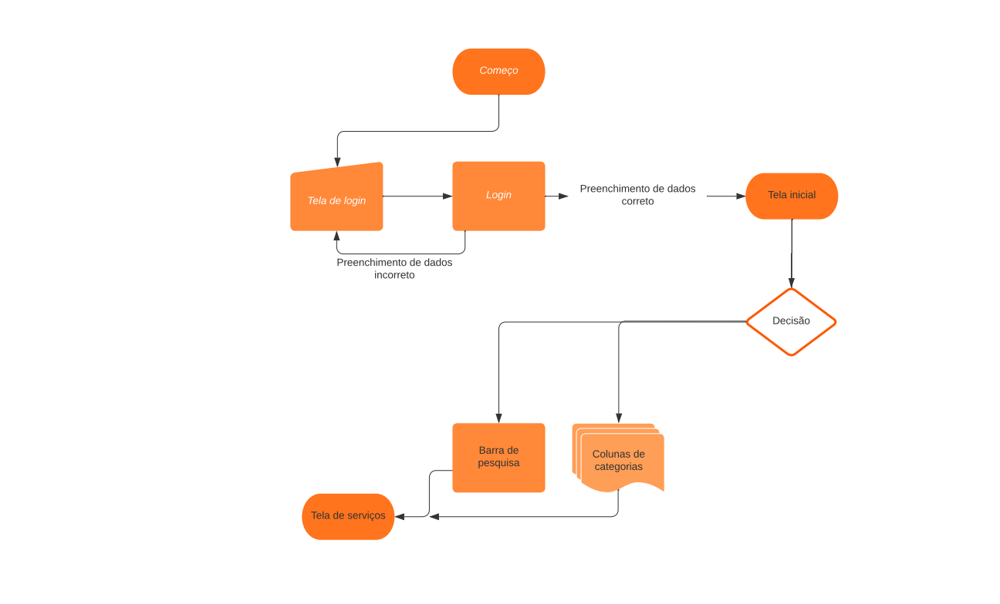
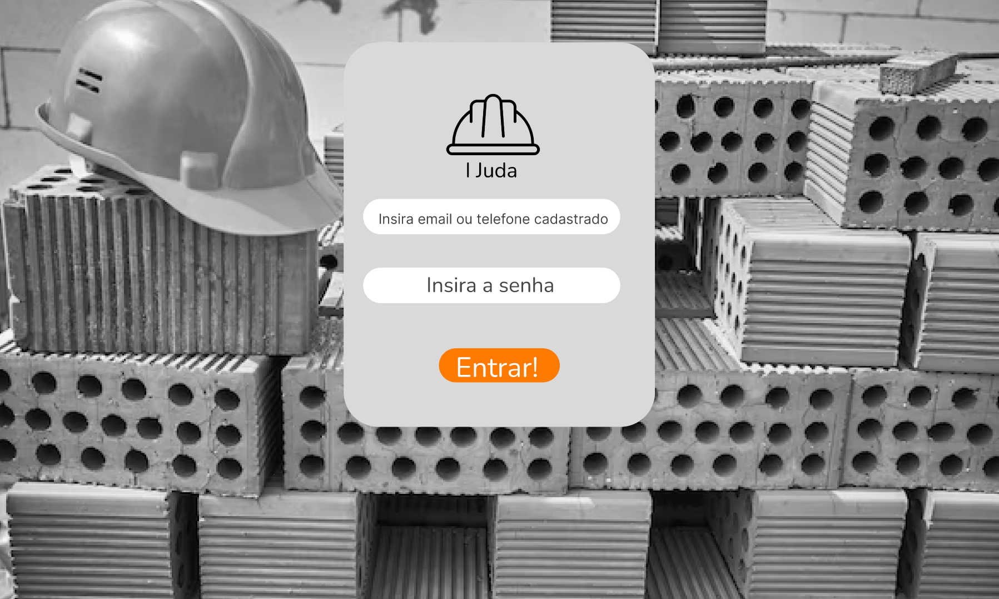
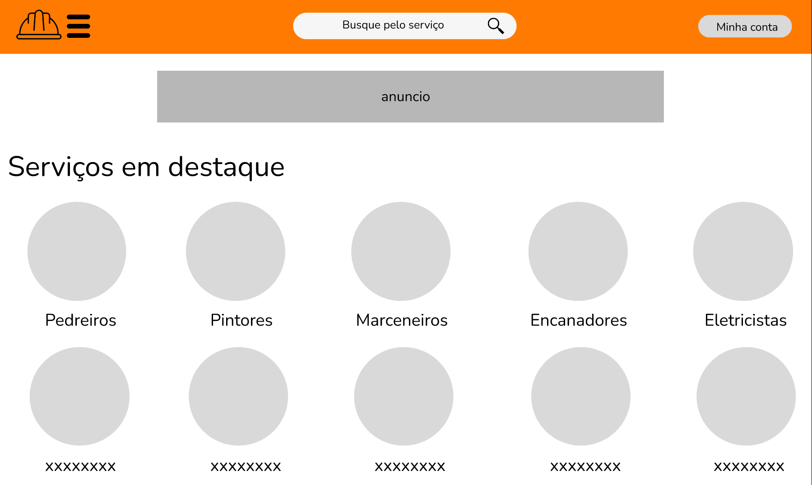
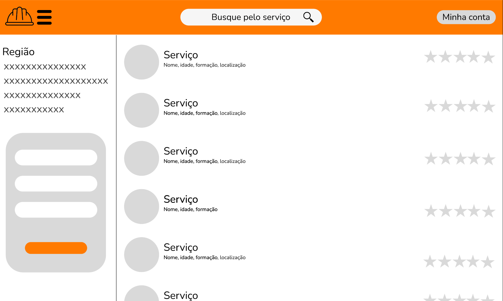

# Informações do Projeto
`TÍTULO DO PROJETO`  

I-Juda

`CURSO` 

Engenharia de Software

## Participantes

Os membros do grupo são: 
 - David Dias Pinto
 - Vinicius Salles de Oliveira
 - João Pedro de Moura Borges
 - Miguel Lessa
 - Victor Rafael de Neiva Machado
 - Caio Lúcio Marx
 - Luiz Felipe Araujo Rocha

# Estrutura do Documento

- [Informações do Projeto](#informações-do-projeto)
  - [Participantes](#participantes)
- [Estrutura do Documento](#estrutura-do-documento)
- [Introdução](#introdução)
  - [Problema](#problema)
  - [Objetivos](#objetivos)
  - [Justificativa](#justificativa)
  - [Público-Alvo](#público-alvo)
- [Especificações do Projeto](#especificações-do-projeto)
  - [Personas e Mapas de Empatia](#personas-e-mapas-de-empatia)
  - [Histórias de Usuários](#histórias-de-usuários)
  - [Requisitos](#requisitos)
    - [Requisitos Funcionais](#requisitos-funcionais)
    - [Requisitos não Funcionais](#requisitos-não-funcionais)
  - [Restrições](#restrições)
- [Projeto de Interface](#projeto-de-interface)
  - [User Flow](#user-flow)
  - [Wireframes](#wireframes)
- [Metodologia](#metodologia)
  - [Divisão de Papéis](#divisão-de-papéis)
  - [Ferramentas](#ferramentas)
  - [Controle de Versão](#controle-de-versão)
- [**############## SPRINT 1 ACABA AQUI #############**](#-sprint-1-acaba-aqui-)
- [Projeto da Solução](#projeto-da-solução)
  - [Tecnologias Utilizadas](#tecnologias-utilizadas)
  - [Arquitetura da solução](#arquitetura-da-solução)
- [Avaliação da Aplicação](#avaliação-da-aplicação)
  - [Plano de Testes](#plano-de-testes)
  - [Ferramentas de Testes (Opcional)](#ferramentas-de-testes-opcional)
  - [Registros de Testes](#registros-de-testes)
- [Referências](#referências)

# Introdução

## Problema

Com o crescimento do desemprego e incertezas na economia, muitas pessoas se veem sem opção a não ser recorrer a um emprego não formal sem carteira de trabalho, serviços freelances. No entanto, encontrar esses trabalhadores pode ser um desafio para possíveis empregadores.

## Objetivos

O projeto tem como objetivo ser o ponto médio entre trabalhadores e empregadores, de forma rápida, fácil, intuitiva e segura com recursos de comunicação com fim de negociar diretamente entre si.

## Justificativa

A motivação para esse projeto vem do fato de que vária pessoas, tanto os trabalhadores quantos os empregadores, são obrigados a sair de sua comodidade para ir para as ruas procurar por indicações. E esse método tem uma baixíssima eficiência, ocasionando muitas vezes em perda de tempo valioso e escassez de mão de obra/trabalho.

## Público-Alvo

Pessoas que necessitam de serviços freelance, mas não conseguem encontrar facilmente.
 
# Especificações do Projeto

Nesta parte buscamos definir exatamente os problemas e os pontos mais importantes neste projeto, Utilizando:
- Entrevistas Qualitativas
- Personas
- Requisitos
- Restrições

## Personas e Mapas de Empatia

1. **Cleiton Silva Santos** tem 56 anos de idade, é Pedreiro, tem como hobby fazer churrasco. Ele é centrado e extrovertido, e seu sonho é fornecer o melhor para a sua família. Utiliza seu celular tanto para lazer no tempo livre, quanto para buscar novos serviços. Seu principal objetivo é terminar o serviço com êxito e categoria, sendo esta sua renda principal, logo precisa sempre de novos serviços o quanto antes para se sustentar e logicamente, facilidade para encontrar essas novas ofertas de trabalho.

2. **Lúcio Mário Mesquita** tem 40 anos de idade, Empresário bem-sucedido, tem como hobby jogar e assistir futebol. Ele é uma pessoa mais séria e trabalhadora, se esforça dando tudo que tem e até o que não tem para alcançar seus objetivos, sendo alguns deles: ver o sucesso dos seus filhos e criar uma família feliz, estável e equilibrada. Trabalha utilizando celular, computador e redes sociais juntamente com marketing digital. O que mais busca é uma rápida contratação de diversos serviços sem precisar sair do seu conforto e principalmente sem perder tempo, pois tempo é dinheiro.

3. **Sônia Pereira** tem 32 anos de idade, Jornalista, tem como hobby ler e praticar alpinismo. Ela já é mais crítica, questionadora e prepotente, nunca deixa um detalhe, mesmo que seja mínimo, passar e sempre ajuda com dicas e opiniões construtivas. Seu maior sonho é cobrir uma grande matéria. Utiliza muito celular, notebook, gravador e blocos de notas principalmente para pesquisar e escrever matérias. Necessita da rápida contratação de serviços, encontrando a mão de obra mais perto, preços acessíveis e de qualidade para poder terminar de construir sua casa.

## Histórias de Usuários

Com base na análise das personas foram identificadas as seguintes histórias de usuários:

|EU COMO... `PERSONA`| QUERO/PRECISO ... `FUNCIONALIDADE` |PARA ... `MOTIVO/VALOR`                          |
|--------------------|------------------------------------|-------------------------------------------------|
|Cleiton Silva Santos| Facilidade de oferta de serviço    | Sustentar financeiramente a si e a família      |
|Lúcio Mário Mesquita| Rápida contratação de serviço      | Não precisar sair de seu conforto e perder tempo|
|Sônia Pereira       | Contratar trabalhador próximo      | Finalizar sua casa o mais rapido possível       |

## Requisitos

As tabelas que se seguem apresentam os requisitos funcionais e não funcionais que detalham o escopo do projeto.

### Requisitos Funcionais

|ID    | Descrição do Requisito                                         | Prioridade |
|------|------------------------------------------------------------------|-------|
|RF-001| Cadastro de Usuários                                             | ALTA  | 
|RF-002| Função de encontrar serviços por proximidade                     | ALTA  |
|RF-003| Filtro de busca                                                  | MEDIA |
|RF-004| Ranking de usuário com base em preço,experiencia,habilidades,etc | BAIXA |
|RF-005| Histórico de trabalhos realizados e avaliações recebidas         | MEDIA |
|RF-006| Sistema de avaliação de usuários                                 | ALTA  |

### Requisitos não Funcionais

|ID     | Descrição do Requisito                                          | Prioridade |
|-------|-------------------------------------------------------------------|-------|
|RNF-001| O sistema deve ser responsivo para rodar em dispositivos móveis   | ALTA  | 
|RNF-002| Login separado para contratante e trabalhador                     | ALTA  |
|RNF-003| Paleta de cores combinando                                        | MEDIA |
|RNF-004| Interface Simples e Intuitiva                                     | ALTA  |
|RNF-005| Acessibilidade                                                    | MEDIA |

## Restrições

O projeto está restrito pelos itens apresentados na tabela a seguir.

|ID| Restrição                                             |
|--|-------------------------------------------------------|
|01| O projeto deverá ser entregue até o final do semestre |
|02| Não pode ser desenvolvido um módulo de backend        |

# Projeto de Interface

Aqui estão as principais interfaces da solução: Página inicial de Login, Página principal, Página de busca por categoria.
Cada uma dessas interfaces foi desenvolvida pensando na rapidez, praticidade e simplicidade para encontrar trabalhadores/ofertar serviços.

## User Flow

## Wireframes

### Tela de Login

### Tela Principal

### Tela de Busca por Categoria

# Metodologia

Utilizamos a metodologia Scrum, pois torna o projeto mais claro e dinâmico e mantém registros de todas as etapas. Dessa forma, os integrantes dos grupos sabem o que precisa ser feito, o que está sendo feito, os artefatos em teste e o que já foi concluído. Dividindo os papeis e as tarefa com base no scrum (Scrum Master - Product Owner - Equipe de Desenvolvimento. E Com o uso de ferramentas como: git e github, Trello, Miro, Figma e VS Code.

## Divisão de Papéis

|           Membro                |            Função             |
| --------------------------------|-------------------------------|
| Miguel Lessa                    | Desenvolvedor e Scrum Master  |
| David Dias Pinto                | Desenvolvedor e Product Owner |
| Vinicius Salles de Oliveira     | Desenvolvedor                 |
| João Pedro de Moura Borges      | Desenvolvedor                 |
| Victor Rafael de Neiva Machado  | Desenvolvedor                 |
| Caio Lúcio Marx                 | Desenvolvedor                 |
| Luiz Felipe Araújo Rocha        | Desenvolvedor                 |

## Ferramentas

- Optamos por utilizar como Editor de Código o VS Code devido a sua integração com git e github. 
- Para o processo de design Thinking foi escolhido o miro por sua facilidade e usabilidade.
- O versionamento do código e seu repositório vão ser feitos pelo git e github, pois ja são ferramentas bem consolidadas.
- A Organização do processo de desenvolvimento foi feito pela plataforma Trello, pelas suas funções, organização e simplicidade.
- O protótipo interativo foi desenvolvido no Figma, por melhor captar as necessidades da nossa solução.

| Ambiente                   | Plataforma              | Link de Acesso                                    |
|----------------------------|-------------------------|---------------------------------------------------|
|Editor de Código            | VS Code                 |                                                   |
|Processo de Design Thinking | Miro                    | https://miro.com/app/board/uXjVMUBNThE=/?share_link_id=966481904481 | 
|versionamento               | Git                     |                                                   |
|Repositório de código       | GitHub                  |https://github.com/ICEI-PUC-Minas-PMGES-TI/pmg-es-2023-1-ti1-2010100-prestadores-de-servicos |                 
|Kanban                      | Trello                  | https://trello.com/b/0tXwWRcI/kanban              | 
|Protótipo Interativo        | Figma                   | www.figma.com/proto/pDWdtFBeRCYo7FKkSSZIfx/I-Juda |

## Controle de Versão

 A ferramenta de controle de versão adotada no projeto foi o
 [Git](https://git-scm.com/), sendo que o [Github](https://github.com)
 foi utilizado para hospedagem do repositório `upstream`.
 
 O projeto segue a seguinte convenção para o nome de branchs:
 
 - `master`: versão estável já testada do software
 - `unstable`: versão já testada do software, porém instável
 - `testing`: versão em testes do software
 - `dev`: versão de desenvolvimento do software
 
 Quanto à gerência de issues, o projeto adota a seguinte convenção para
 etiquetas:
 
 - `bugfix`: uma funcionalidade encontra-se com problemas
 - `enhancement`: uma funcionalidade precisa ser melhorada
 - `feature`: uma nova funcionalidade precisa ser introduzida

# **############## SPRINT 1 ACABA AQUI #############**

# Projeto da Solução

Projeto da Solução

O objetivo deste site  é apresentar o projeto de uma solução tecnológica para a contratação de serviços freelancer. A plataforma será desenvolvida para facilitar a conexão entre os padrões de serviços autônomos e clientes em busca de serviços específicos. A solução visa fornecer uma experiência intuitiva, segura e eficiente para ambas as partes envolvidas, permitindo a contratação de serviços de forma simplificada e transparente.

A solução será baseada em uma arquitetura web, utilizando tecnologias modernas para garantir desempenho, escalabilidade e segurança.

A apresentação será responsável pela interface com o usuário. Será desenvolvida uma interface web responsiva e amigável, permitindo que os clientes pesquisem por serviços e os geradores de serviços autônomos criem e gerenciem seus perfis.

A parte da negociaçao será responsalibade dos proprios usuarios, o site nao sera responsavel por eventuais fatores, Mas serao incluídos módulos para a gestão de contas de usuário, autenticação, gestão de perfis de serviços.

## Tecnologias Utilizadas

Discord: O Discord é uma plataforma de comunicação em tempo real que pode ser utilizada para criar canais de comunicação entre clientes e prestadores de serviços. Ele pode ser usado para trocar informações, discutir detalhes do projeto e manter uma comunicação eficiente.
VSCode: O Visual Studio Code é uma IDE de desenvolvimento que oferece recursos avançados para escrever código em várias linguagens, como JavaScript, HTML, CSS, entre outras. Ele será usado para escrever e depurar o código do aplicativo.
Replit: Replit é uma plataforma online de desenvolvimento que oferece um ambiente integrado para escrever, testar e implantar aplicativos. Ele pode ser usado para desenvolver e hospedar o aplicativo.
Trello: O Trello é uma ferramenta de gerenciamento de projetos baseada em quadros, que permite organizar e acompanhar as tarefas do projeto. Ele pode ser utilizado para gerenciar as etapas de desenvolvimento do aplicativo.
Miro: Miro é uma plataforma colaborativa de criação de diagramas e quadros brancos virtuais. Pode ser usado para criar diagramas de fluxo do usuário, esboços e protótipos de telas para visualizar e discutir o design do aplicativo.
Photoshop: O Photoshop é uma ferramenta de edição de imagens amplamente utilizada. Ele pode ser usado para criar designs gráficos personalizados para o aplicativo, como logotipos, ícones ou elementos visuais.
Github: O GitHub é uma plataforma de hospedagem e controle de versão de código-fonte. Ele será utilizado para armazenar o código do aplicativo, permitir a colaboração entre os membros da equipe e facilitar o gerenciamento de alterações.
Figma: O Figma é uma ferramenta de design de interface do usuário baseada na web. Ele pode ser usado para criar wireframes, storyboards e protótipos interativos de telas do aplicativo.
JavaScript, HTML, CSS, JSON, Bootstrap: Essas linguagens e frameworks serão utilizados para o desenvolvimento front-end do aplicativo, permitindo a criação de uma interface interativa e responsiva.
Serviços web: O aplicativo será desenvolvido como um serviço web, permitindo que os usuários acessem e interajam com ele por meio de um navegador ou aplicativo móvel.

# Avaliação da Aplicação

Testes incrementais das funcionalidades via caixa branca, fazendo testes e correções individuais nas funcionalidades conforme foram desenvolvidas. E quanto aos testes caixa preta feitos por pessoas de fora da equipe de desenvolvimento, testando as funcionalidades de cadastro, exibição de perfil, filtro de pesquisa e barra de pesquisa. 
Um usuário de desejava se cadastrar cliente pois precisava de um serviço de pedreiro feito na sua casa, ele entrou no site e pesquisou sua região pela barra de pesquisas que não funcionava direito. Erro solucionado pela dev team.
Um usuário, desejava se cadastrar funcionário, mas não conseguia, pois o local storage estava com não salvava. Erro resolvido pela dev team.

## Plano de Testes

No processo de desenvolvimento do iJuda, a equipe adotou uma abordagem de testes incrementais e utilizou testes caixa preta realizados por usuários externos para garantir a qualidade e eficiência das funcionalidades. Vamos acompanhar alguns desses testes e as soluções encontradas pela equipe de desenvolvimento.

[Cena 1 - Teste de Caixa Branca: Barra de Pesquisa]
Usuário 1: (Narração) Um usuário deseja encontrar um pedreiro na sua região usando a barra de pesquisa.
Usuário 1: (Interagindo com a barra de pesquisa) "Pedreiro na minha região"
Usuário 1: (Frustrado) A barra de pesquisa não está funcionando corretamente. Não encontro resultados relevantes.

[Dev Team - Sala de Desenvolvimento]
Desenvolvedor 1: (Analisando o problema) Parece que a barra de pesquisa não está retornando resultados precisos para a região especificada.
Desenvolvedor 2: (Investigando o código) Vamos revisar a lógica de pesquisa e a integração com a base de dados para resolver esse problema.

[Cena 2 - Solução de Problema: Barra de Pesquisa]
Desenvolvedor 1: (Implementando as correções) Ajustei a lógica de pesquisa e otimizei a consulta na base de dados para garantir resultados mais precisos.
Desenvolvedor 2: (Testando novamente) Vamos verificar se as alterações corrigiram o problema.

[Usuário 1]
Usuário 1: (Interagindo novamente com a barra de pesquisa) "Pedreiro na minha região"
Usuário 1: (Satisfeito) Agora estou obtendo resultados relevantes. Encontrei vários pedreiros próximos a mim. Ótimo trabalho, equipe de desenvolvimento!

[Cena 3 - Teste de Caixa Branca: Cadastro do Funcionário]
Usuário 2: (Narração) Um usuário deseja se cadastrar como funcionário, mas está enfrentando dificuldades.
Usuário 2: (Preenchendo os campos de cadastro) Nome, e-mail, senha...
Usuário 2: (Recebendo mensagem de erro) "Falha ao salvar o cadastro. Tente novamente."

[Dev Team - Sala de Desenvolvimento]
Desenvolvedor 3: (Investigando o problema) Parece que há um problema com o armazenamento local. Os cadastros não estão sendo salvos corretamente.
Desenvolvedor 4: (Revisando o código) Vamos verificar a integração com o local storage e identificar a origem do erro.

[Cena 4 - Solução de Problema: Cadastro do Funcionário]
Desenvolvedor 3: (Corrigindo o código) Identificamos o problema na integração com o local storage e implementamos a correção necessária.
Desenvolvedor 4: (Realizando o teste) Vamos verificar se o cadastro é salvo corretamente após as alterações.

[Usuário 2]
Usuário 2: (Preenchendo novamente os campos de cadastro) Nome, e-mail, senha...
Usuário 2: (Recebendo mensagem de sucesso) "Cadastro realizado com sucesso!"
Usuário 2: (Satisfeito) Agora consegui me cadastrar como funcionário. Obrigado à equipe de desenvolvimento pela rápida solução!

Conclusão:
Por meio de testes incrementais e utilização de testes caixa preta, a equipe do iJuda identificou e solucionou problemas, garantindo uma experiência melhor para os usuários. A abordagem profissional de testes assegurou a qualidade do site, tornando-o um ambiente confiável e eficiente para a contratação de freelancers.
## Ferramentas de Testes (Opcional)

## Registros de Testes

Registro de Testes - Período: 15 a 27 de junho

15/06

Teste de caixa preta: Cadastro de usuário cliente concluído com sucesso.
Teste de caixa preta: Cadastro de usuário funcionário finalizado sem problemas.
Teste de caixa branca: Verificação da integração com API de pagamento realizada.
17/06

Teste de caixa preta: Atualização de perfil do usuário cliente efetuada com sucesso.
Teste de caixa preta: Atualização de perfil do usuário funcionário realizado com êxito.
Teste de caixa branca: Validação dos campos de formulário no cadastro de usuário verificada.
20/06

Teste de caixa preta: Pesquisa de freelancers por habilidade concluída com sucesso.
Teste de caixa preta: Filtro de pesquisa por localização validado com êxito.
Teste de caixa branca: Avaliação da eficiência das consultas de pesquisa na base de dados executada.
23/06

Teste de caixa preta: Visualização de perfil de freelancer bem-sucedida.
Teste de caixa preta: Exibição do portfólio de freelancer validada.
Teste de caixa branca: Avaliação da performance do carregamento de dados na página de perfil.
27/06

Teste de caixa preta: Edição de perfil do usuário cliente concluída com sucesso.
Teste de caixa preta: Edição de perfil do usuário funcionário realizado com êxito.
Teste de caixa branca: Verificação da consistência dos dados salvos após a edição de perfil.

# Referências

https://edicaodobrasil.com.br/2022/07/08/mais-de-60-dos-brasileiros-aderiram-ao-trabalho-freelancer-ha-menos-de-um-ano/#:~:text=de%20um%20ano-,Mais%20de%2060%25%20dos%20brasileiros%20aderiram%20ao%20trabalho,há%20menos%20de%20um%20ano&text=Durante%20a%20crise%20sanitária%20de,milhões%20de%20pessoas%20nesta%20condição.

https://agenciadenoticias.ibge.gov.br/agencia-noticias/2012-agencia-de-noticias/noticias/30235-com-pandemia-20-estados-tem-taxa-media-de-desemprego-recorde-em-2020#:~:text=A%20taxa%20média%20de%20desocupação,menores%2C%20no%20Sul%20do%20país.

https://freelancer.com.br/projetos

https://www.getninjas.com.br/?utm_source=GoogleSearch&utm_medium=cpc&utm_campaign=1885394313&adGroupId=72971951994&feedItemId=&targetId=kwd-740913278308&utm_term=b-%2Bsite%20para%20%2Bcontratar%20%2Bservi%C3%A7os&utm_content=396308130677&matchtype=b&device=c&device_model=&placement=&network=g&gclid=EAIaIQobChMI78StvoPa_wIVoEFIAB2YsQ3lEAAYASAAEgKesfD_BwE

https://www.ibge.gov.br/explica/desemprego.php

https://www.ibge.gov.br/estatisticas/economicas/servicos/9068-demografia-das-empresas.html
